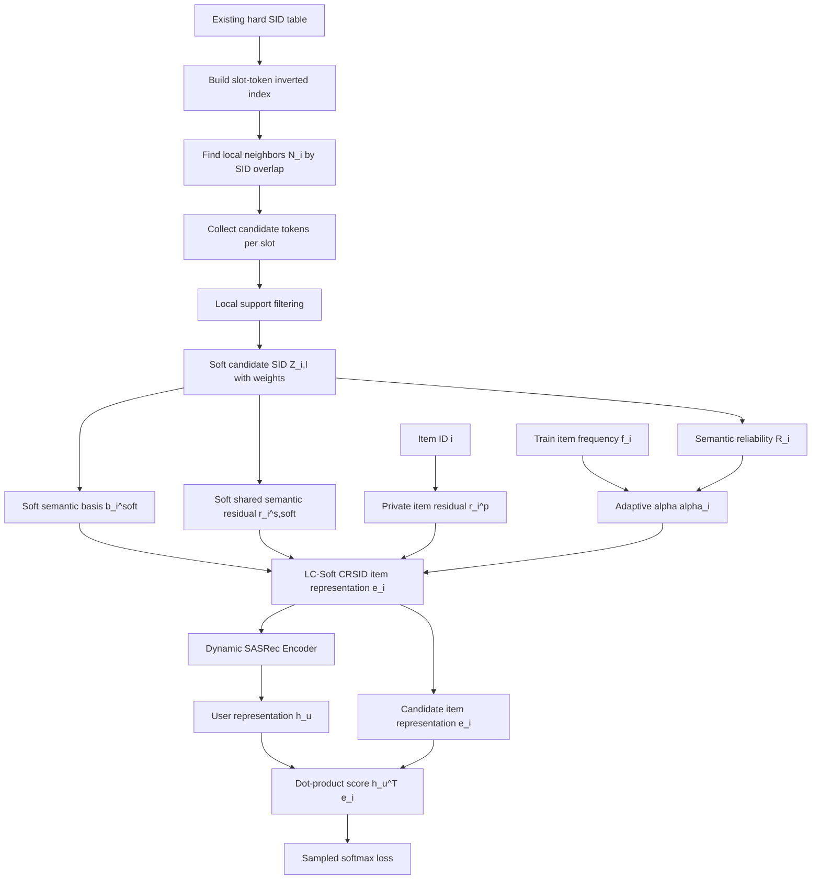
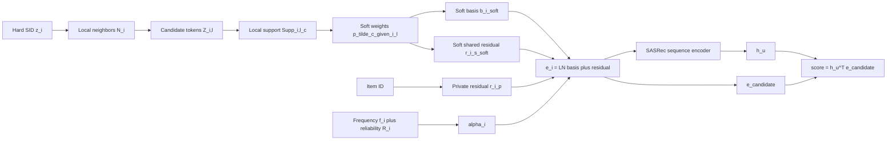

# LC-Soft CRSID 方法说明

记录时间：`20260604_072533`

本文档描述当前 soft Semantic ID 版本的完整方法流程。当前方法可以命名为：

```text
LC-Soft CRSID
Local-Consistent Soft Collaborative-Residual Semantic ID Representation
```

核心思想是：将原本单一路径的 hard Semantic ID 改造为 local-consistent soft Semantic ID，再将其用于 CRSID 的 semantic basis 和 shared semantic residual 构造。

## 1. 方法动机

原 hard CRSID 使用每个 item 的单一路径 Semantic ID：

$$
z_i = [z_{i,1}, z_{i,2}, z_{i,3}, z_{i,4}]
$$

这种 hard assignment 有两个问题。

第一是 under-sharing。真实同系列 item 可能因为量化误差被分到不同 token，导致无法稳定共享语义残差。例如 HP 940XL Cyan 可能被分为：

$$
[1,52,140,388]
$$

而同系列 Black / Yellow / Magenta 可能是：

$$
[1,43,140,*]
$$

它们本应共享系列语义，但 hard SID 使其在 prefix 上被切开。

第二是 over-sharing。某些热门 Semantic ID token 覆盖大量商品，例如 printer ink、binder、notebook、marker、laminator、label 等都可能共享部分泛办公 token。此时一个共享 token embedding 会把不同局部语义区域混在一起，导致语义漂移。

因此，LC-Soft CRSID 不再直接使用单一 hard SID，而是为每个 item/slot 构造局部一致的候选 token 集合：

$$
Z_{i,l}
=
\{(c_{i,l,m}, \tilde{p}(c_{i,l,m}\mid i,l))\}_{m=1}^{M}
$$

然后使用 soft candidate SID 构造 item 表示。

## 2. Soft SID 构造过程

### 2.1 建立 slot-token 倒排索引

给定 hard SID：

$$
z_i = [z_{i,1}, z_{i,2}, \ldots, z_{i,L}]
$$

首先建立每个 slot-token 对应的 item 集合：

$$
\mathcal{I}(l,c)
=
\{i \mid z_{i,l}=c\}
$$

该倒排索引用于快速统计两个 item 在 Semantic ID 上共享了多少槽位。

### 2.2 构造 item 的局部邻居

对 item \(i\) 和 item \(j\)，定义 SID overlap：

$$
\operatorname{overlap}(i,j)
=
\sum_{l=1}^{L}
\mathbf{1}[z_{i,l}=z_{j,l}]
$$

如果：

$$
\operatorname{overlap}(i,j) \geq \rho
$$

则认为 \(j\) 是 \(i\) 的局部语义邻居。当前默认：

```text
cr_soft_min_overlap_slots = 2
cr_soft_max_neighbors = 50
```

因此局部邻居为：

$$
\mathcal{N}(i)
=
\operatorname{TopK}_{j}
\{j \mid \operatorname{overlap}(i,j)\geq 2\}
$$

其中 TopK 按 overlap 数量排序，最多保留 50 个邻居。

### 2.3 收集每个 slot 的候选 token

对 item \(i\) 的第 \(l\) 个 slot，在其局部邻居中统计该 slot 上出现过的 token：

$$
\operatorname{cnt}_{i,l}(c)
=
\sum_{j\in \mathcal{N}(i)}
\mathbf{1}[z_{j,l}=c]
$$

局部支持度定义为：

$$
\operatorname{Supp}_{i,l}(c)
=
\frac{
\operatorname{cnt}_{i,l}(c)
}{
|\mathcal{N}(i)|
}
$$

如果候选 token 的局部支持度低于阈值：

$$
\operatorname{Supp}_{i,l}(c) < \delta
$$

则剪掉该 token。当前默认：

```text
cr_soft_min_support = 0.05
```

这一步用于抑制全局热门但局部不一致的 token，避免 soft SID 引入更多假共享。

### 2.4 hard token 强制保留

为了避免 soft SID 完全偏离原 hard assignment，原始 hard token 会被强制加入候选集合：

$$
z_{i,l} \in Z_{i,l}
$$

并给它一个 hard-token prior：

$$
\operatorname{cnt}_{i,l}(z_{i,l})
\leftarrow
\operatorname{cnt}_{i,l}(z_{i,l})
+
\lambda_{\mathrm{hard}}|\mathcal{N}(i)|
$$

当前最优配置中：

```text
cr_soft_hard_token_prior = 1.0
```

实验显示 `hard_token_prior=2.0` 会变差，说明 hard SID 确实存在错配，不能过度相信原 hard token。

### 2.5 计算 soft token 权重

候选 token 的打分为：

$$
s_{i,l}(c)
=
\operatorname{cnt}_{i,l}(c)^\eta
$$

归一化后得到 soft token 权重：

$$
\tilde{p}(c\mid i,l)
=
\frac{
s_{i,l}(c)
}{
\sum_{c'\in Z_{i,l}}s_{i,l}(c')
}
$$

当前 Beauty 最优配置为：

```text
cr_soft_support_eta = 2.0
```

这说明局部支持度更高的 token 应该被更强地强调。

## 3. Soft Semantic 表示构造

### 3.1 Soft Semantic Basis

hard CRSID 中 semantic basis 为：

$$
b_i
=
W_b
\left(
\frac{1}{L}
\sum_{l=1}^{L}
E_b(z_{i,l})
\right)
$$

LC-Soft CRSID 将其改为 soft semantic basis：

$$
b_i^{\mathrm{soft}}
=
W_b
\left(
\frac{1}{L}
\sum_{l=1}^{L}
\sum_{c\in Z_{i,l}}
\tilde{p}(c\mid i,l)E_b(c)
\right)
$$

其中 \(E_b\) 是 semantic basis token embedding。

### 3.2 Soft Shared Semantic Residual

hard CRSID 中 shared semantic residual 为：

$$
r_i^{s}
=
\frac{1}{L}
\sum_{l=1}^{L}
E_s(z_{i,l})
$$

LC-Soft CRSID 将其改为：

$$
r_i^{s,\mathrm{soft}}
=
\frac{1}{L}
\sum_{l=1}^{L}
\sum_{c\in Z_{i,l}}
\tilde{p}(c\mid i,l)E_s(c)
$$

其中 \(E_s\) 是 shared semantic residual token embedding。

### 3.3 Private Item Residual

private item residual 不变：

$$
r_i^p = E_p(i)
$$

它用于保留 item 自身独有的协同过滤偏移。

## 4. Reliability-Calibrated Alpha

soft SID 可以为每个 item 估计一个语义可靠性分数。当前实现中，item reliability 来自 soft token 的局部支持度加权平均：

$$
R_i
=
\frac{1}{L}
\sum_{l=1}^{L}
\sum_{c\in Z_{i,l}}
\tilde{p}(c\mid i,l)
\operatorname{Supp}_{i,l}(c)
$$

然后 residual mixture coefficient 为：

$$
\alpha_i
=
\frac{
f_i
}{
f_i + \tau R_i
}
$$

其中 \(f_i\) 是 item 在训练历史中的出现次数。

直觉是：

```text
R_i 高：
  SID 局部一致，shared semantic residual 更可信；
  tau * R_i 更大，alpha_i 更小，更多使用 shared residual。

R_i 低：
  SID 不可靠或局部孤立；
  alpha_i 更大，避免盲目依赖 shared residual。
```

不过当前 Beauty 实验显示 reliability alpha 的收益不明显。当前主要收益来自 local-consistent soft SID pooling，而不是 reliability-calibrated alpha。

## 5. LC-Soft CRSID Item Representation

最终 item representation 为：

$$
e_i
=
\operatorname{LayerNorm}
\left(
b_i^{\mathrm{soft}}
+
\lambda
\left[
\alpha_i r_i^p
+
(1-\alpha_i)r_i^{s,\mathrm{soft}}
\right]
\right)
$$

其中：

- \(b_i^{\mathrm{soft}}\)：local-consistent soft semantic basis。
- \(r_i^p\)：private item residual。
- \(r_i^{s,\mathrm{soft}}\)：local-consistent soft shared semantic residual。
- \(\alpha_i\)：private/shared residual mixture coefficient。
- \(\lambda\)：residual scale。

## 6. 序列建模与打分

给定用户历史序列：

$$
S_u = [i_1,i_2,\ldots,i_t]
$$

LC-Soft CRSID 先为序列中每个 item 构造表示：

$$
[e_{i_1}, e_{i_2}, \ldots, e_{i_t}]
$$

然后输入动态 SASRec encoder：

$$
h_u
=
\operatorname{SASRecEncoder}
(e_{i_1}, e_{i_2}, \ldots, e_{i_t})
$$

候选 item \(i\) 的推荐分数为：

$$
s(u,i)
=
h_u^\top e_i
$$

训练目标仍然是 sampled softmax：

$$
\mathcal{L}_{rec}
=
-\log
\frac{
\exp(s(u,i^+))
}{
\sum_{j\in \mathcal{C}_u}
\exp(s(u,j))
}
$$

LC-Soft CRSID 不引入新的 semantic branch、gate 或 auxiliary loss。方法变化主要发生在 item representation construction 阶段。

## 7. 方法框架图

### 7.1 整体流程



### 7.2 公式结构



## 8. 当前最优配置

Beauty 当前最优实验为：

```text
27_crsid_soft_m4_s005_prior1_eta2_n50
```

对应参数：

```text
model_variant = crsid_soft
cr_tail_tau = 20
cr_residual_scale = 1.0

cr_soft_top_m = 4
cr_soft_min_overlap_slots = 2
cr_soft_min_support = 0.05
cr_soft_support_eta = 2.0
cr_soft_hard_token_prior = 1.0
cr_soft_reliability_floor = 0.10
cr_soft_max_neighbors = 50
```

Beauty 结果：

```text
SASRec NDCG@10 = 0.044830
QSD semantic-score NDCG@10 = 0.042957
Hard CRSID NDCG@10 = 0.051643
LC-Soft CRSID NDCG@10 = 0.052575
```

相对 hard CRSID：

```text
NDCG@10: +1.80%
HR@10: +1.39%
NDCG@20: +0.80%
```

## 9. 当前实验结论

1. LC-Soft CRSID 相比 hard CRSID 有小幅提升，说明 hard SID 的过硬 assignment 确实存在可修正空间。

2. `top_m=8` 变差，说明 soft candidate 不是越多越好，候选过多会重新引入 over-sharing 和 noisy sharing。

3. `hard_token_prior=2.0` 变差，说明不能过度相信原 hard SID。soft candidate 的价值在于修正 hard assignment 错配。

4. `support_eta=2.0` 最好，说明局部一致性强的 token 应被更高权重强调。

5. 当前主要收益来自 local-consistent soft SID pooling，reliability alpha 不是核心收益来源。

## 10. 论文叙事建议

建议将论文主线从 “frequency-adaptive CRSID” 调整为：

```text
Hard Semantic ID suffers from under-sharing and over-sharing.
We introduce local-consistent soft Semantic IDs to preserve limited assignment uncertainty
while suppressing locally unsupported token sharing.
The resulting soft SID is then used in a collaborative-residual item representation.
```

中文表述：

```text
现有 hard Semantic ID 将每个 item 强制分配到单一路径，这会带来两类问题：
一方面，真实同系列 item 可能因为量化误差被分到不同 token，导致 under-sharing；
另一方面，热门 token 覆盖大量语义区域，容易造成 over-sharing 和语义漂移。
为此，本文提出 local-consistent soft SID，为每个 item/slot 保留有限候选 token，
并利用局部邻居中的 token 支持度对候选进行重加权，从而在保留语义不确定性的同时抑制假共享。
```
