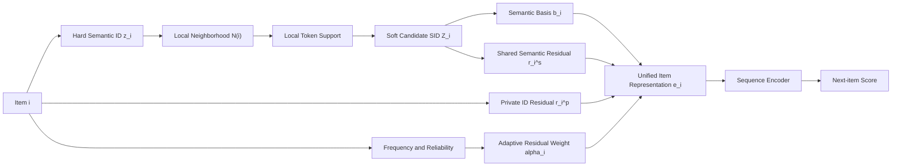

# LC-Soft CRSID 论文方法文档

记录时间：`20260604_073200`

建议方法名：

```text
LC-Soft CRSID
Local-Consistent Soft Collaborative-Residual Semantic ID Recommendation
```

本文档按照论文方法部分的方式描述当前方法。这里不把方法叙述为对某个已有模型的简单改动，而是从序列推荐中 ID 表示、Semantic ID 共享、Semantic ID 长尾错配三个问题出发，定义一个新的 item 表示学习框架。

## 1. 问题定义与核心观察

在序列推荐中，每个用户的历史交互序列表示为：

$$
S_u = [i_1, i_2, \ldots, i_t],
$$

目标是在候选物品集合中预测下一个交互物品：

$$
i_{t+1}.
$$

传统 item ID 表示具有强记忆能力，能够精确区分不同物品，但对训练中出现次数较少的长尾物品泛化不足。Semantic ID 表示把物品映射为一组可共享的离散语义 token：

$$
z_i = [z_{i,1}, z_{i,2}, \ldots, z_{i,L}],
$$

其中 \(L\) 是 Semantic ID 的层数或槽位数。Semantic ID 的优势是共享：如果多个物品共享部分 token，它们可以共享语义参数和训练梯度，从而缓解低频物品的学习不足。

但是 badcase 分析显示，Semantic ID 的共享并不总是可靠。它同时存在三类关键问题。

第一，ID 信息与语义信息需要平衡。ID 表示更适合记忆热门物品和精确物品差异；Semantic ID 更适合低频物品和簇级泛化。如果只依赖 ID，会损失语义泛化；如果过度依赖语义共享，又会产生簇内漂移。

第二，Semantic ID 内部存在长尾现象。部分低频物品虽然在 item 层面属于某个稳定系列，但在 Semantic ID 空间中可能成为孤立点，无法从同系列物品获得共享梯度。同时，一些热门 Semantic ID token 覆盖大量泛化主题，会在推荐时挤压真正的长尾目标。

第三，Semantic ID 存在错配。离散量化得到的 hard SID 可能把真实相似的物品切到不同 prefix 中。例如某个 HP 940XL Cyan 墨盒可能被分到：

$$
[1,52,140,388],
$$

而同系列 Black / Yellow / Magenta 墨盒主要位于：

$$
[1,43,140,\ast].
$$

如果模型只使用单一路径 hard SID，那么这些物品无法稳定共享系列语义。另一方面，像 Fellowes Laminator 这类物品虽然可能有较大的 prefix group，但共享簇内部混入 notebook、binder、marker 等热门办公主题，导致语义漂移。

因此，方法目标不是简单增加一个语义分支，而是重新构造 item 表示：在一个统一表示中同时保留 ID 私有性、语义共享性和局部一致性。

## 2. 方法总览

LC-Soft CRSID 的核心思想是为每个物品构造一个局部一致的 soft Semantic ID 表示，并用协同残差结构将语义共享信息和 ID 私有信息组合为最终 item embedding。

整体流程如下：



方法由三部分组成：

1. Local-Consistent Soft SID：把单一路径 hard SID 扩展为局部一致的多候选 token 表示，缓解 Semantic ID 错配和 under-sharing。

2. Collaborative Residual Item Representation：用语义共享残差和 ID 私有残差共同构造 item embedding，平衡语义泛化和 ID 记忆。

3. Reliability-aware Residual Allocation：根据物品频次和语义可靠性分配共享残差与私有残差的比例，缓解 Semantic ID 长尾和热门 token 过共享。

## 3. Local-Consistent Soft Semantic ID

### 3.1 从 hard SID 到 soft candidate SID

给定物品 \(i\) 的 hard Semantic ID：

$$
z_i = [z_{i,1}, z_{i,2}, \ldots, z_{i,L}],
$$

LC-Soft CRSID 不再认为每个槽位只有一个绝对正确的 token，而是为第 \(l\) 个槽位构造一个候选 token 集合：

$$
Z_{i,l}
=
\{(c_{i,l,m}, p(c_{i,l,m}\mid i,l))\}_{m=1}^{M},
$$

其中 \(M\) 是每个槽位最多保留的候选 token 数，\(p(c\mid i,l)\) 表示 token \(c\) 在物品 \(i\) 的第 \(l\) 个槽位上的可信权重。

这样做的动机是：hard SID 的单点分配可能有误，但它的邻域中仍然包含有用的语义线索。Soft candidate SID 允许一个物品在保持主 SID 的同时，对其他局部一致的候选 token 建立弱共享关系。

### 3.2 局部邻域构造

定义物品 \(i\) 的局部邻域为：

$$
\mathcal{N}(i)
=
\mathcal{N}_{\mathrm{sem}}(i)
\cup
\mathcal{N}_{\mathrm{beh}}(i).
$$

其中 \(\mathcal{N}_{\mathrm{sem}}(i)\) 表示语义邻域，可以由 Semantic ID overlap、文本 embedding、类目、品牌等物品侧信息构造；\(\mathcal{N}_{\mathrm{beh}}(i)\) 表示行为邻域，可以由用户序列中的共现、共购买、同一用户历史中的近邻物品等用户侧协同信息构造。

在当前可运行代码中，局部邻域先使用 Semantic ID overlap 近似：

$$
\operatorname{overlap}(i,j)
=
\sum_{l=1}^{L}
\mathbf{1}[z_{i,l}=z_{j,l}],
$$

并保留满足下式的邻居：

$$
j \in \mathcal{N}(i)
\quad \Longleftrightarrow \quad
\operatorname{overlap}(i,j) \ge \rho.
$$

默认配置为：

$$
\rho = 2,\qquad |\mathcal{N}(i)| \le 50.
$$

论文表述中，\(\mathcal{N}_{\mathrm{beh}}(i)\) 是方法的重要扩展方向：它用于补充 hard SID 无法表达的用户侧相似性。例如两个物品在 SID prefix 上不完全一致，但经常出现在相似用户历史或同一购买序列中，它们仍可通过行为邻域产生候选 token 支持。

### 3.3 局部 token 支持度

对物品 \(i\) 的第 \(l\) 个槽位和候选 token \(c\)，定义局部支持计数：

$$
\operatorname{cnt}_{i,l}(c)
=
\sum_{j\in \mathcal{N}(i)}
\mathbf{1}[z_{j,l}=c].
$$

局部支持度为：

$$
\operatorname{Supp}_{i,l}(c)
=
\frac{\operatorname{cnt}_{i,l}(c)}
{|\mathcal{N}(i)|}.
$$

若某个 token 在全局很热门，但在物品 \(i\) 的局部邻域中很少出现，则它更可能是假共享 token。因此方法使用局部一致性阈值过滤候选 token：

$$
c \notin Z_{i,l}
\quad \text{if} \quad
\operatorname{Supp}_{i,l}(c) < \delta.
$$

当前实验中使用：

$$
\delta = 0.05.
$$

这一步直接对应 over-sharing 问题：热门 token 不是被全局粗暴降权，而是只有在当前物品的局部邻域中得到支持时才参与共享。

### 3.4 hard token 保留与 soft 权重

为了避免 soft SID 完全偏离原始量化结果，hard token 会被保留：

$$
z_{i,l} \in Z_{i,l}.
$$

同时给 hard token 一个先验计数：

$$
\operatorname{cnt}_{i,l}(z_{i,l})
\leftarrow
\operatorname{cnt}_{i,l}(z_{i,l})
+
\lambda_{\mathrm{hard}} |\mathcal{N}(i)|.
$$

然后对候选 token 计算未归一化分数：

$$
s_{i,l}(c)
=
\operatorname{cnt}_{i,l}(c)^{\eta}.
$$

最终 soft 权重为：

$$
p(c\mid i,l)
=
\frac{s_{i,l}(c)}
{\sum_{c'\in Z_{i,l}} s_{i,l}(c')}.
$$

当前 Beauty 数据集上较优配置为：

$$
M=4,\quad
\lambda_{\mathrm{hard}}=1.0,\quad
\eta=2.0.
$$

实验现象显示，\(\lambda_{\mathrm{hard}}=2.0\) 会变差，说明 hard SID 中确实存在错配，不能过度相信原始 hard assignment；\(M=8\) 也会变差，说明候选集合过大会重新引入噪声共享。

## 4. 协同残差物品表示

LC-Soft CRSID 用一个统一 item 表示同时编码三类信息：

1. 语义基础表示：描述物品的主要语义区域。

2. 共享语义残差：提供跨物品的语义泛化能力。

3. 私有 ID 残差：保留每个物品不可共享的个体差异。

### 4.1 Soft Semantic Basis

给定 soft candidate SID，物品 \(i\) 的语义基础表示为：

$$
b_i
=
W_b
\left(
\frac{1}{L}
\sum_{l=1}^{L}
\sum_{c\in Z_{i,l}}
p(c\mid i,l) E_b(c)
\right),
$$

其中 \(E_b(c)\) 是 semantic basis token embedding，\(W_b\) 是线性映射。

这一部分提供 item 的主要语义坐标。与 hard SID 相比，soft basis 不再由单一路径决定，而是由局部一致的候选 token 加权得到。

### 4.2 Shared Semantic Residual

共享语义残差定义为：

$$
r_i^{s}
=
\frac{1}{L}
\sum_{l=1}^{L}
\sum_{c\in Z_{i,l}}
p(c\mid i,l) E_s(c),
$$

其中 \(E_s(c)\) 是 semantic residual token embedding。

该残差负责跨物品共享梯度。对于低频物品，即使它自身训练次数很少，只要它与其他物品共享可靠 token，就可以通过 \(E_s(c)\) 获得语义泛化。

### 4.3 Private ID Residual

私有 ID 残差定义为：

$$
r_i^{p}
=
E_p(i),
$$

其中 \(E_p(i)\) 是物品 \(i\) 的私有 item embedding。

该残差负责保留 item-level 个体差异，尤其适合热门物品和容易发生簇内混淆的物品。它避免所有共享同一语义 token 的物品被压到过于相似的位置。

### 4.4 Reliability-aware Residual Allocation

为了平衡 ID 私有信息和语义共享信息，定义物品 \(i\) 的训练频次为 \(f_i\)，语义可靠性为 \(R_i\)。当前实现中 \(R_i\) 由 soft SID 的局部支持度估计：

$$
R_i
=
\frac{1}{L}
\sum_{l=1}^{L}
\sum_{c\in Z_{i,l}}
p(c\mid i,l)
\operatorname{Supp}_{i,l}(c).
$$

然后定义私有残差权重：

$$
\alpha_i
=
\frac{f_i}
{f_i + \tau R_i}.
$$

最终残差为：

$$
r_i
=
\alpha_i r_i^{p}
+
(1-\alpha_i) r_i^{s}.
$$

直观上，频次较高的物品拥有更充分的 ID 监督，因此可以更多依赖私有残差；频次较低但语义邻域可靠的物品可以更多依赖共享语义残差。若某个物品语义可靠性不足，模型不会盲目放大不稳定共享。

最终 item 表示为：

$$
e_i
=
\operatorname{LayerNorm}
\left(
b_i + \lambda_r r_i
\right),
$$

其中 \(\lambda_r\) 是残差缩放系数，当前实验中使用：

$$
\lambda_r=1.0.
$$

## 5. 序列建模与训练目标

给定用户历史序列：

$$
S_u=[i_1,i_2,\ldots,i_t],
$$

首先将每个物品映射为统一 item 表示：

$$
E_u=[e_{i_1},e_{i_2},\ldots,e_{i_t}].
$$

然后使用 causal Transformer 编码用户当前兴趣：

$$
h_u
=
\operatorname{Encoder}(E_u).
$$

对候选物品 \(j\)，预测分数为：

$$
\hat{y}_{u,j}
=
h_u^\top e_j.
$$

训练时使用正样本和采样负样本上的交叉熵损失。设候选集合为：

$$
\mathcal{C}_u
=
\{i^+\}\cup \mathcal{N}_u^-,
$$

其中 \(i^+\) 是真实下一个物品，\(\mathcal{N}_u^-\) 是负样本集合，则损失为：

$$
\mathcal{L}_{\mathrm{rec}}
=
-
\log
\frac{
\exp(\hat{y}_{u,i^+})
}{
\sum_{j\in \mathcal{C}_u}
\exp(\hat{y}_{u,j})
}.
$$

当前主要实验中没有额外引入复杂辅助损失。因此方法收益主要来自 item 表示构造本身，而不是堆叠额外优化目标。

## 6. 方法如何对应 badcase 发现

### 6.1 解决 ID 与语义的平衡

纯 ID 表示在热门物品上记忆能力强，但对训练次数很少的目标物品泛化不足。Semantic ID 表示对低频物品有共享梯度，但会带来语义漂移。LC-Soft CRSID 用：

$$
r_i
=
\alpha_i r_i^{p}
+
(1-\alpha_i)r_i^{s}
$$

在 item 表示层面统一二者，而不是在最终分数上简单相加。这样用户序列编码器看到的是已经融合后的 item 表示，ID 信息和语义信息可以共同影响用户状态建模。

### 6.2 解决 Semantic ID 的长尾问题

Semantic ID 的长尾问题并不只是 item frequency 低，而是低频物品在 SID 空间中也可能缺少可靠共享邻居。LC-Soft CRSID 通过局部邻域统计候选 token，使低频物品可以从同系列或同局部语义区域的物品中恢复可共享 token。

例如 Epson WorkForce 系列这类低频目标，如果用户历史中出现过同系列商品，soft SID 可以让目标物品获得系列级共享语义，从而提升进入 top-k 的概率。

同时，对于被热门办公用品 token 挤压的低频目标，局部支持剪枝会过滤那些全局热门但局部不一致的 token，降低热门语义簇对长尾目标的吸引。

### 6.3 解决 Semantic ID 错配

HP 940XL Cyan 的例子说明，hard SID 可能把同系列商品切到不同 prefix。若只使用 hard prefix sharing，则 target 的 prefix group 可能只有 1，无法借力于历史中的 Black / Yellow / Magenta 墨盒。

Soft SID 允许 target 在第 2 个槽位保留 hard token \(52\) 的同时，通过局部邻域引入候选 token \(43\)：

$$
Z_{i,2}
=
\{(52,p_{52}), (43,p_{43}), \ldots\}.
$$

只要 \(43\) 在局部邻域中得到足够支持，target 就可以和同系列墨盒建立弱共享关系，从而缓解 under-sharing。

### 6.4 抑制共享过多导致的语义漂移

Fellowes Laminator Neptune3 的失败案例说明，拥有较大 prefix group 不一定等价于可靠泛化。如果共享 token 覆盖 notebook、binder、marker 等多个办公主题，一个共享 embedding 会把候选拉向错误语义区域。

LC-Soft CRSID 的局部一致性约束要求候选 token 在当前物品邻域中出现，而不是只根据全局频次出现。这样全局热门但局部不支持的 token 会被过滤，降低 over-sharing。

### 6.5 对孤立物品的处理

Five Star Locker Light 这类物品的问题是：item 层面可能与用户历史中的 Five Star locker shelf 有关联，但 hard SID 空间中却表现为孤立。对于这类样本，方法依赖两点：

1. soft SID 通过非完全 prefix 的 overlap 或行为邻域补充潜在共享 token。

2. 当局部邻域支持不足时，私有 ID 残差保留 item-level 差异，避免模型盲目跟随其他热门语义主题。

这也说明第三个创新点的重要性：仅靠物品侧 hard SID 不够，用户侧行为邻域应作为 Semantic ID 的额外补充来源。

## 7. 与普通语义增强方法的区别

LC-Soft CRSID 不是简单的 score-level semantic branch，也不是在 ID 分数和语义分数之间增加一个后验 gate。它的关键区别在于：

1. 语义修正在 item 表示构造阶段完成，而不是在最终分数阶段补一个语义得分。

2. Semantic ID 从单一路径 hard assignment 变为局部一致的 soft candidate SID。

3. 共享不是全局无条件共享，而是由局部支持度决定的可靠共享。

4. ID 私有信息不是被语义信息替代，而是作为残差保留在同一个 item embedding 中。

5. 训练目标保持简洁，主要验证表示结构本身是否有效。

因此，该方法可以被概括为：一种面向 Semantic ID 长尾错配问题的局部一致 soft SID 表示学习方法。

## 8. 当前实验配置与结果记录

当前 Beauty 数据集上较优配置为：

```text
model_variant = crsid_soft
cr_tail_tau = 20
cr_residual_scale = 1.0
cr_soft_top_m = 4
cr_soft_min_overlap_slots = 2
cr_soft_min_support = 0.05
cr_soft_support_eta = 2.0
cr_soft_hard_token_prior = 1.0
cr_soft_reliability_floor = 0.10
cr_soft_max_neighbors = 50
dim = 128
batch_size = 1024
max_len = 50
lr = 0.001
weight_decay = 0.0001
```

已有 Beauty 结果中，较优 soft 版本为：

```text
27_crsid_soft_m4_s005_prior1_eta2_n50
NDCG@10 = 0.0525746212
HR@10   = 0.0911773912
NDCG@20 = 0.0615855541
```

相对 hard CRSID：

```text
10_crsid_hard_tau20_s10
NDCG@10 = 0.0516429289
HR@10   = 0.0899253231
NDCG@20 = 0.0610999571
```

soft 版本在 Beauty 上取得了小幅但稳定的提升，说明 local-consistent soft SID 的方向有效。后续需要在 Office、Beauty 大规模复现实验以及 high-sharing / low-frequency 分组实验中进一步验证：

1. 是否提升低频 target 的 Recall 和 NDCG。

2. 是否降低 high-sharing 子集中的语义漂移错误。

3. 是否减少 top-k 推荐中过热门办公主题对长尾目标的挤压。

4. 引入用户侧行为邻域后，是否进一步改善 hard SID mismatch 的样本。

## 9. 论文写法建议

论文中可以把方法贡献组织为以下三点：

1. 提出 Collaborative-Residual Semantic ID Representation，在统一 item embedding 中平衡 ID 私有记忆和 Semantic ID 共享泛化。

2. 发现 Semantic ID 表示中的长尾与过共享问题，并提出 Local-Consistent Soft SID，通过局部支持度构造多候选 SID，缓解 under-sharing 和 over-sharing。

3. 将用户侧行为邻域作为 Semantic ID 的补充来源，使 hard SID 不能覆盖的 item-level 关联可以进入语义表示构造过程，从而提升长尾和错配样本的建模能力。

对应的方法摘要可以写为：

> We propose LC-Soft CRSID, a local-consistent soft Semantic ID representation learning framework for sequential recommendation. Instead of treating each item as a single hard Semantic ID path, LC-Soft CRSID constructs a locally supported candidate token distribution for each Semantic ID slot, which mitigates both under-sharing caused by Semantic ID mismatch and over-sharing caused by popular semantic tokens. Based on the soft Semantic ID, each item is represented by a semantic basis, a shared semantic residual, and a private ID residual. A reliability-aware residual allocation mechanism adaptively balances semantic generalization and item-level memorization. The resulting item representation is directly used by the sequence encoder and optimized with the standard next-item recommendation objective.
