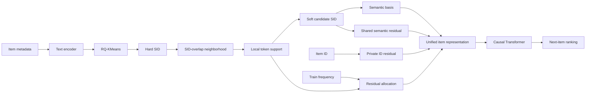

# LC-SoftCRSID：面向语义标识长尾与错误共享的局部一致协同残差序列推荐

> 初稿版本：2026-06-07  
> 预计篇幅：按常见双栏会议模板约 11--13 页，最终页数取决于模板、字号、图表尺寸和参考文献格式。  
> 当前状态：方法、主结果、模块消融和分组实验已写入；数据集完整统计、重复种子均值方差和显著性检验仍待补充。

## 摘要

序列推荐通常以独立 Item ID 表示物品。该表示具有较强的物品级记忆能力，但无法在语义相近物品之间共享统计强度，因此对交互稀疏的长尾物品泛化不足。近年来，Semantic ID 通过残差量化将物品内容编码为可共享的离散 token 序列，为长尾推荐提供了新的表示途径。然而，现有方法通常直接使用量化得到的单一路径 Hard Semantic ID，并默认共享相同 token 的物品具有一致语义。我们的案例分析表明，该假设在实际推荐数据中并不总是成立：一方面，量化边界可能将真实相似的物品切分到不同语义路径，造成共享不足；另一方面，高频语义 token 可能覆盖多个细粒度主题，造成过度共享和语义漂移。此外，完全依赖 Semantic ID 会削弱模型对物品个体差异的记忆能力。

为此，本文提出 **LC-SoftCRSID**，一种面向序列推荐的局部一致 Soft Semantic ID 与协同残差表示框架。首先，LC-SoftCRSID 不将 RQ-KMeans 的离散结果视为不可修正的最终身份，而是根据物品在 Semantic ID 空间中的局部邻域，为每个语义槽位构造多候选 token 分布，并利用局部支持度过滤不可靠共享。其次，模型将物品表示分解为 Soft Semantic Basis、Shared Semantic Residual 和 Private ID Residual，在统一表示空间中同时保留语义泛化与物品级记忆。最后，模型结合物品训练频次和局部语义可靠性，自适应分配共享残差与私有残差的比例。该表示直接输入因果 Transformer，并使用标准下一物品预测目标训练，不依赖额外辅助损失。

在 Office、Beauty、Sports 以及 Toys and Games 四个 Amazon 数据集上的实验表明，相比纯 ID 的 SASRec，LC-SoftCRSID 在 NDCG@10 上分别取得 10.10%、14.65%、20.71% 和 11.24% 的相对提升。相比单一路径 Hard CRSID，LC-SoftCRSID 在四个数据集上的 NDCG@10 分别提升 2.15%、0.22%、1.50% 和 0.54%。进一步分析显示，方法在低频物品、孤立 Semantic ID 以及热门语义 token 子集上具有更明显的优势。与此同时，严格 Hard SID mismatch 子集仍是当前方法的主要边界，因为局部邻域构造仍依赖初始 SID 重叠。上述结果说明，可靠的 Semantic ID 共享与物品私有记忆应在表示层联合建模，而不能通过简单分数相加或无条件 token 共享实现。

**关键词：** 序列推荐；Semantic ID；残差量化；长尾推荐；协同残差；局部一致性

---

## 1 引言

序列推荐旨在根据用户按时间排列的历史交互预测下一次可能发生的行为。与静态推荐相比，序列推荐不仅需要识别用户长期偏好，还需要捕获近期意图和物品之间的顺序依赖。以 SASRec 为代表的自注意力方法通过因果 Transformer 对历史序列进行编码，在多个公开数据集上展现了较强的建模能力 [1]。然而，这类模型通常为每个物品分配一个独立的 Item ID embedding。独立 ID 有利于精确区分物品，却也使不同物品之间缺少参数共享。当目标物品仅在训练集中出现少量次数时，其 ID embedding 很难获得充分监督，进而形成显著的长尾性能差距。

内容表示为缓解这一问题提供了一条自然路径。若两个物品在标题、品牌、类目或描述上相似，它们应当能够共享部分语义统计，而不必完全依赖各自有限的交互。Semantic ID 将连续内容向量量化为层次化离散 token 序列，使多个物品能够通过共享 token 共享参数和梯度。TIGER 将 Semantic ID 作为生成式推荐中的目标标识 [3]；相关排序研究也表明，Semantic ID 能够改善新物品和长尾物品的泛化 [4]。LETTER 等工作进一步将协同信号和码本分配约束引入 item tokenization [5]。这些研究证明了离散语义标识的潜力，但大多将重点放在如何构造或生成 Semantic ID，而较少讨论量化后的 Hard SID 在判别式序列推荐中应当如何可靠共享。

本文从实际错误案例出发重新审视这一问题。我们首先比较了纯 ID 模型与简单语义增强模型在 high-sharing 和 low-frequency 子集上的预测差异。结果显示，Semantic ID 的共享确实能够召回部分纯 ID 模型难以记忆的低频物品。例如，当用户历史中出现 Epson WorkForce 系列商品时，语义分支能够利用系列级共享将同系列低频目标拉入 Top-K。然而，Semantic ID 也会造成新的错误：对于 Fellowes Laminator 等物品，大规模共享簇中混杂的 notebook、binder、marker 等热门办公主题可能获得更高分数；对于 HP 940XL Cyan Ink Cartridge，真实同系列墨盒可能因为量化边界差异而落入不同 SID 路径；对于 Five Star Locker Light，物品层面存在关联，但目标在 SID 空间中近似孤立，无法稳定获得共享收益。

这些案例揭示了 Semantic ID 推荐中的两个互相制约的问题。其一是 **under-sharing**：真实相关物品因 Hard SID 分配差异而无法共享；其二是 **over-sharing**：覆盖范围过大的热门 token 将细粒度主题混在一起，造成语义漂移。更根本地说，Semantic ID 共享解决的是泛化问题，而独立 Item ID 解决的是记忆问题。若只使用 ID，长尾物品缺乏共享；若只使用 SID，模型又会丢失物品级差异。简单地在最终推荐分数上相加两类信号，并不能保证进入序列编码器的物品表示本身具有一致的语义结构。

基于上述观察，本文提出 **LC-SoftCRSID（Local-Consistent Soft Collaborative-Residual Semantic ID Recommendation）**。方法首先将 RQ-KMeans 输出的 Hard SID 视为初始语义锚点，而非最终且唯一的语义身份。对于每个物品，模型根据同位置 SID token 的重叠构建局部邻域，并在每个槽位上统计候选 token 的局部支持度。由此得到的 Local-Consistent Soft SID 允许物品以不同权重连接多个候选 token，同时过滤缺乏局部证据的共享关系。在表示层，LC-SoftCRSID 将物品表示分解为语义基底、共享语义残差和私有 ID 残差，再根据物品频次和局部语义可靠性完成残差分配。这样，低频且语义结构可靠的物品可以更多利用共享参数，而高频或语义结构不稳定的物品可以保留更多私有信息。

需要强调的是，本文并未修改 RQ-KMeans 的聚类目标、码本中心或量化误差。本文研究的是 **如何改进 RQ-derived Semantic ID 在下游序列推荐中的使用方式**：Hard SID 不再被无条件接受，共享关系需要局部证据，语义泛化也不再替代物品私有记忆。该定位使方法可以作为现有 Semantic ID 构建器之后的轻量表示层使用，无需端到端重新训练大型文本编码器或生成式解码器。

本文的主要贡献如下：

1. 本文通过序列推荐错误案例系统分析 Semantic ID 空间中的共享不足、过度共享和 token 热度偏置，并将其与 Item ID 的记忆能力不足统一为“可靠语义共享与物品私有记忆的平衡”问题。
2. 本文提出 Local-Consistent Soft SID，根据局部 SID 邻域将单一路径 Hard SID 扩展为槽位级候选 token 分布，从而对量化输出进行局部校准，并抑制缺乏局部支持的噪声共享。
3. 本文提出 Collaborative-Residual Item Representation，将 Soft Semantic Basis、Shared Semantic Residual 与 Private ID Residual 融合为统一物品表示，并通过频次与可靠性感知的残差分配机制平衡泛化和记忆。
4. 四个 Amazon 数据集上的单种子结果显示，完整框架相对纯 ID 和简单语义融合具有一致优势；模块消融与困难子集分析进一步说明，共享残差、私有残差以及 Local-Consistent Soft SID 分别承担不同作用，同时揭示了严格 SID mismatch 仍未被完全解决的边界。

## 2 相关工作

### 2.1 序列推荐

早期序列推荐方法主要使用 Markov Chain、循环神经网络或卷积网络建模用户行为顺序。SASRec 使用单向自注意力在稀疏和稠密场景之间取得较好的平衡，并成为序列推荐中广泛使用的基础架构 [1]。BERT4Rec 进一步通过双向 Transformer 和 Cloze 任务建模上下文关系 [2]。后续工作围绕兴趣解耦、时间间隔、对比学习和图结构等方向扩展序列编码器。

本文不试图提出新的序列编码器，而是关注序列编码器之前的物品表示。LC-SoftCRSID 使用与 SASRec 相同的因果 Transformer 作为用户历史编码器，使性能差异主要来自物品表示方式，而不是更复杂的用户建模网络。这种设计也使纯 ID、简单语义增强、Hard CRSID 与 LC-SoftCRSID 可以在相同序列主干下进行对照。

### 2.2 内容增强与长尾推荐

独立 Item ID 能够记忆物品级协同模式，但无法自然迁移到低频或新物品。内容增强推荐通常利用文本、图像、类目或知识图谱补充 ID 表示。连续内容 embedding 可以在相似物品之间提供平滑泛化，但过度依赖内容也可能损害协同记忆。Singh 等人指出，直接以内容表示替代随机 ID 可能降低整体推荐质量，并提出利用离散 Semantic ID 在泛化与记忆之间取得平衡 [4]。

与将内容向量直接拼接到 Item ID 不同，本文利用离散 SID token 形成参数共享，同时显式保留 Private ID Residual。与固定拼接或得分级融合相比，残差表示使语义和 ID 信息在进入用户序列编码器之前已经被组织为统一向量。模块消融显示，移除私有残差会造成大幅性能下降，说明内容共享不能完全替代物品身份。

### 2.3 Semantic ID 与生成式推荐

Semantic ID 通常通过 RQ-VAE、RQ-KMeans 或其他残差量化方法，将连续物品内容向量转换为多个离散码字。TIGER 使用 Semantic ID 表示物品，并通过序列到序列模型自回归生成下一物品的 token 序列，在冷启动和检索场景中表现出良好的泛化能力 [3]。LETTER 从层次语义、协同正则和码字分配多样性角度改进生成式推荐中的 item tokenization [5]。ETEGRec 则将 tokenizer 与生成式推荐目标进行端到端联合优化，以减少离线 tokenization 和下游任务之间的目标偏差 [6]。

上述方法主要关注 tokenizer 训练或自回归生成。LC-SoftCRSID 面向判别式下一物品排序，保留全物品点积打分范式，并把 Hard SID 的不确定性放在下游表示层处理。具体而言，本文不重新学习码本，而是把量化输出视为初始锚点，通过局部支持构造 Soft SID，并用 shared/private residual 处理共享与辨识之间的冲突。因此，本文与 tokenizer 侧方法是互补关系：更好的量化器可以提供更可靠的初始 SID，而 LC-SoftCRSID 仍可用于校准其下游共享。

### 2.4 本文与现有 RQ-SID 方法的区别

现有 RQ-SID 方法常将每个物品表示为确定 token 序列：

$$
z_i=[z_{i,1},z_{i,2},\ldots,z_{i,L}],
$$

并直接对 token embedding 做组合，或者将该序列作为生成目标。该范式隐含两个假设：量化路径足够准确；共享同一 token 的物品能够无条件共享参数。本文认为，这两个假设在推荐场景中都可能被物品热度和细粒度意图破坏。

LC-SoftCRSID 的区别体现在三个层面。第一，Hard SID 是可校准的初始锚点，每个槽位可以保留多个局部候选。第二，token 共享必须得到局部邻域支持，而不是只由全局码字相等决定。第三，Semantic ID 只负责可共享部分，物品不可共享的个体差异由 Private ID Residual 显式承载。由此，本文的改进发生在“SID 如何参与推荐表示”的层面，而不是“RQ-KMeans 如何聚类”的层面。

## 3 问题定义与经验观察

### 3.1 序列推荐任务

设用户集合为 \(\mathcal U\)，物品集合为 \(\mathcal I\)。用户 \(u\) 的按时间排序交互序列为：

$$
S_u=[i_1,i_2,\ldots,i_t],\qquad i_k\in\mathcal I.
$$

目标是学习参数为 \(\Theta\) 的评分函数 \(f_\Theta(S_u,j)\)，使真实下一物品 \(i_{t+1}\) 在候选集合中具有更高排名：

$$
\hat y_{u,j}=f_\Theta(S_u,j).
$$

每个物品同时具有独立 Item ID 和由内容构建的 Hard Semantic ID：

$$
z_i=[z_{i,1},z_{i,2},\ldots,z_{i,L}],
$$

其中 \(L\) 为量化层数，\(z_{i,l}\) 表示第 \(l\) 个码本中的 token。

### 3.2 Item ID 的长尾限制

独立 ID embedding \(E_p(i)\) 的更新次数与物品在训练集中的出现次数高度相关。设训练频次为 \(f_i\)。对于头部物品，模型能够从大量交互中学习细粒度偏好；对于 \(f_i\) 很小的长尾物品，独立 embedding 的估计方差更高，也难以从相似物品获得迁移。纯 ID 方法因此倾向于将高分分配给训练充分的热门候选。

### 3.3 Semantic ID 的共享收益

若多个物品共享部分 token，例如：

$$
[61,19,232,497],\quad
[61,19,112,497],\quad
[61,19,205,497],
$$

它们可以共同更新 token \(61\)、\(19\) 或 \(497\) 的 embedding。即使第一个目标物品本身出现很少，共享 token 仍可获得来自其他物品的训练信号。这是 Semantic ID 改善长尾推荐的主要来源。Beauty 的低频分组实验也支持这一观察：LC-SoftCRSID 相比 SASRec 的 NDCG@10 提升 42.68%。

### 3.4 Under-sharing、Over-sharing 与 Mismatch

共享并非总是可靠。本文将问题划分为三种情况。

**Under-sharing。** 真实相关物品被量化到不同路径，使目标在 SID 空间中缺少可共享邻居。HP 940XL Cyan 与 Black、Yellow、Magenta 墨盒属于同系列，但其部分槽位可能不同，导致 prefix group 很小。

**Over-sharing。** 高频 token 覆盖多个主题，共享 embedding 无法区分同一大类中的细粒度意图。例如办公用品 token 可能同时覆盖墨盒、标签、文件夹、笔记本和覆膜机。当用户历史包含多个办公主题时，简单语义分支可能将候选拉向更密集、更热门的主题。

**Strict mismatch。** 用户历史中存在标题或品牌层面明显相关的物品，但目标与该物品在相同位置上只共享 0--1 个 SID token。当前 LC-SoftCRSID 的语义邻域要求至少两个槽位重叠，因此无法直接跨越这种严重量化边界。本文将其作为方法边界，而不把局部 Soft SID 夸大为对所有 mismatch 的完整修复。

## 4 LC-SoftCRSID 方法

### 4.1 方法总览

LC-SoftCRSID 包含三个核心步骤：Local-Consistent Soft SID、Collaborative-Residual Item Representation 和 Reliability-aware Residual Allocation。完整流程如下。

上游文本编码与 RQ-KMeans 只执行一次，Soft SID 表也在训练开始前离线构造。训练过程中需要更新的是语义基底 token embedding、共享残差 token embedding、私有 Item ID embedding 以及序列编码器参数。

### 4.2 Hard Semantic ID 构建

对于物品 \(i\)，将标题、品牌、类目和描述拼接为文本：

$$
x_i=\operatorname{Concat}(x_i^{title},x_i^{brand},x_i^{category},x_i^{desc}).
$$

预训练文本编码器将其映射为归一化连续向量 \(v_i\)。随后使用逐层残差 K-Means。令初始残差为 \(r_i^{(1)}=v_i\)，第 \(l\) 层选择最近聚类中心：

$$
z_{i,l}=\arg\min_k\left\|r_i^{(l)}-c_k^{(l)}\right\|_2^2,
$$

并更新：

$$
r_i^{(l+1)}=r_i^{(l)}-c_{z_{i,l}}^{(l)}.
$$

经过 \(L\) 层量化后得到 Hard SID。当前项目默认使用四层码本 \([64,128,256,512]\)。LC-SoftCRSID 不改变上述量化过程，而是在其输出之后校准 token 共享关系。

### 4.3 Local-Consistent Soft SID

#### 4.3.1 局部邻域

定义物品 \(i\) 与 \(j\) 的对齐槽位重叠数：

$$
o(i,j)=\sum_{l=1}^{L}\mathbb I[z_{i,l}=z_{j,l}].
$$

语义局部邻域为：

$$
\mathcal N(i)=\{j\neq i\mid o(i,j)\ge \rho\}.
$$

实验中设 \(\rho=2\)，并按重叠数排序后最多保留 50 个邻居。与只使用 prefix 的方案不同，该定义允许任意两个对齐槽位形成联系，因此能够覆盖部分非前缀共享。

#### 4.3.2 槽位级局部支持

对于第 \(l\) 个槽位上的 token \(c\)，定义邻域计数：

$$
n_{i,l}(c)=\sum_{j\in\mathcal N(i)}\mathbb I[z_{j,l}=c],
$$

以及局部支持度：

$$
q_{i,l}(c)=\frac{n_{i,l}(c)}{\max(|\mathcal N(i)|,1)}.
$$

只保留满足 \(q_{i,l}(c)\ge\delta\) 的邻域候选，当前 \(\delta=0.05\)。该约束的作用不是全局压低热门 token，而是判断该 token 对当前物品是否具有局部证据。

#### 4.3.3 Hard token 保留与候选加权

为避免局部平滑完全覆盖原始量化结果，Hard token \(z_{i,l}\) 始终被加入候选集合，并获得先验计数：

$$
\widetilde n_{i,l}(z_{i,l})
=n_{i,l}(z_{i,l})+\max(1,\lambda_h|\mathcal N(i)|).
$$

其他候选使用邻域计数。候选分数为：

$$
s_{i,l}(c)=\widetilde n_{i,l}(c)^\eta,
$$

保留得分最高的 \(M\) 个 token，并归一化：

$$
p(c\mid i,l)=
\frac{s_{i,l}(c)}{\sum_{c'\in Z_{i,l}}s_{i,l}(c')}.
$$

最终每个槽位表示为：

$$
Z_{i,l}=\{(c_{i,l,m},p_{i,l,m})\}_{m=1}^{M}.
$$

正式配置采用 \(M=4\)、\(\lambda_h=1\) 和 \(\eta=2\)。\(M\) 限制候选范围，\(\eta>1\) 强调局部支持更稳定的 token，Hard prior 则保证表示不会在邻域噪声下完全偏离初始量化结果。

### 4.4 Collaborative-Residual Item Representation

Soft SID 被用于构造两组独立的共享 embedding。第一组表示稳定语义基底：

$$
b_i=W_b\left(
\frac{1}{L}\sum_{l=1}^{L}
\sum_{c\in Z_{i,l}}p(c\mid i,l)E_b(c)
\right),
$$

其中 \(E_b\) 是 basis token embedding，\(W_b\) 是线性映射。

第二组表示共享语义残差：

$$
r_i^s=\frac{1}{L}\sum_{l=1}^{L}
\sum_{c\in Z_{i,l}}p(c\mid i,l)E_s(c).
$$

将语义基底与共享残差分开，可以让一个分量承担主要语义坐标，另一个分量承担对推荐任务有用的共享偏移。二者都在拥有相同候选 token 的物品之间共享参数。

物品私有残差为：

$$
r_i^p=E_p(i),
$$

其中 \(E_p\) 是独立 Item ID embedding。该分量保留品牌、型号、颜色、包装规格等无法由粗粒度 SID token 完整表达的物品差异。

### 4.5 频次与可靠性感知的残差分配

Soft SID 的局部可靠性定义为候选 token 支持度的加权平均：

$$
R_i=\frac{1}{L}\sum_{l=1}^{L}
\sum_{c\in Z_{i,l}}p(c\mid i,l)q_{i,l}(c).
$$

实现中设置可靠性下限 \(R_i\ge 0.1\)，以避免无邻居物品导致数值退化。训练频次 \(f_i\) 仅由训练序列统计，不使用验证和测试目标。私有残差权重为：

$$
\alpha_i=\frac{f_i}{f_i+\tau R_i},
$$

其中 \(\tau=20\)。最终残差为：

$$
r_i=\alpha_i r_i^p+(1-\alpha_i)r_i^s.
$$

当物品频次较高时，\(\alpha_i\) 增大，模型更多保留私有 ID 信息；当物品频次较低且局部语义支持可靠时，共享残差占比上升；当可靠性较低时，\(R_i\) 减小，模型不会盲目依赖共享语义。

最终物品表示为：

$$
e_i=\operatorname{LayerNorm}\left(b_i+\lambda_r r_i\right),
$$

其中 \(\lambda_r=1\)。训练阶段在该表示之后使用 dropout。

### 4.6 序列编码与预测

用户历史被映射为：

$$
E_u=[e_{i_1},e_{i_2},\ldots,e_{i_t}].
$$

加入位置 embedding 后，使用带因果掩码的 Transformer 编码序列，并取最后位置作为用户当前状态：

$$
h_u=\operatorname{CausalTransformer}(E_u)_{t}.
$$

候选物品 \(j\) 的得分为：

$$
\hat y_{u,j}=h_u^\top e_j.
$$

历史物品和候选物品共享同一 LC-SoftCRSID 表示函数，因此语义校准不仅影响候选打分，也影响用户状态的形成。

### 4.7 训练目标

每个训练样本由历史序列、真实下一物品 \(i^+\) 和随机负样本集合 \(\mathcal N_u^-\) 构成：

$$
\mathcal C_u=\{i^+\}\cup\mathcal N_u^-.
$$

损失为 sampled softmax 交叉熵：

$$
\mathcal L_{rec}=-\log
\frac{\exp(\hat y_{u,i^+})}
{\sum_{j\in\mathcal C_u}\exp(\hat y_{u,j})}.
$$

当前主实验没有启用额外语义损失、对比损失或残差正则，即：

$$
\mathcal L=\mathcal L_{rec}.
$$

因此性能变化主要来自物品表示结构，而不是额外监督目标。

### 4.8 复杂度分析

Soft SID 构造是训练前离线步骤。通过槽位 token 倒排表，可以收集与物品共享 token 的候选邻居。设每个物品最多保留 \(K_n\) 个邻居、每槽位保留 \(M\) 个候选，则训练时语义池化复杂度为 \(O(LMd)\)，其中 \(d\) 为 embedding 维度。由于当前 \(L=4\)、\(M=4\)，其开销相对 Transformer 序列编码较小。与自回归生成 Semantic ID 的方法不同，LC-SoftCRSID 仍然采用点积排名，不需要 beam search、无效 token 序列约束或 collision 解码。

## 5 实验设置

### 5.1 数据集与预处理

实验使用 Amazon Review 数据中的 Office Products、All Beauty、Sports and Outdoors 以及 Toys and Games。交互按时间排序，并执行 5-core 过滤，即每个用户和物品至少保留 5 次交互。对于每个用户，最后一个交互作为测试目标，倒数第二个作为验证目标，其余交互用于训练。训练样本由训练序列中的所有前缀构造。

| Dataset | Users/Test Cases | Items | Interactions | 说明 |
|---|---:|---:|---:|---|
| Office | 4,905 | 2,420 | 53,258 | 本地保留完整统计 |
| Beauty | 22,363 | 待从服务器 `stats.json` 补充 | 待补充 | 测试样本数来自分组评测 |
| Sports | 35,598 | 待补充 | 待补充 | 测试样本数来自分组评测 |
| Toys and Games | 11,268 | 待补充 | 待补充 | 测试样本数来自分组评测 |

物品文本由 title、brand/store、categories、description/features 组成。文本编码后使用 RQ-KMeans 构建四层 Semantic ID。正式实验应在最终版本中补充具体文本编码器名称、版本和下载地址。

### 5.2 对比方法

**SASRec。** 使用纯 Item ID embedding 的因果自注意力序列推荐基线。项目中通过关闭所有语义分数并使用单兴趣表示实现，与 LC-SoftCRSID 共享序列主干和训练协议。

**QSDRec。** 在 ID 序列模型之外加入简单 Semantic ID 匹配分数，用于验证分数级语义增强是否足以解决长尾问题。

**Hard CRSID。** 使用 Hard Semantic ID 构造 semantic basis 和 shared residual，同时保留 private residual。该方法与 LC-SoftCRSID 结构相同，但每个槽位只有一个 Hard token，用于隔离 Soft SID 的增益。

**LC-SoftCRSID。** 本文完整方法。主结果表中历史实验名称 `LC-SoftSID` 对应本文的 LC-SoftCRSID Full。

### 5.3 实现细节

统一设置最大序列长度为 50，embedding 维度为 128，Transformer 使用 2 层、2 个注意力头和 0.2 dropout。优化器为 AdamW，学习率为 \(10^{-3}\)，权重衰减为 \(10^{-4}\)，梯度裁剪阈值为 5。每个正样本采样 100 个随机负样本。模型根据验证集 NDCG@10 早停，并加载最佳验证 checkpoint 进行全物品排序测试。评测时屏蔽用户历史中已交互物品，报告 HR@5/10/20 和 NDCG@5/10/20。

LC-SoftCRSID 的默认参数为：\(M=4\)、\(\rho=2\)、\(\delta=0.05\)、\(\eta=2\)、\(\lambda_h=1\)、最大邻居数 50、可靠性下限 0.1、\(\tau=20\)。Beauty、Sports 和 Toys 使用 batch size 1024；Office 现有完整对照批次使用 batch size 512，且 Soft SID 的 \(\eta=1\)。该差异将在最终统一实验中处理。

### 5.4 评测问题

实验围绕以下问题展开：

- **RQ1：** LC-SoftCRSID 是否优于纯 ID 和简单语义融合？
- **RQ2：** Soft SID 是否在 Hard CRSID 之上提供额外收益？
- **RQ3：** semantic basis、shared residual、private residual 和局部一致性分别起什么作用？
- **RQ4：** 方法是否在 low-frequency、high-sharing、isolated-SID 和 popular-token 子集上获得更明显收益？
- **RQ5：** 当前方法在哪些场景下仍然失败？

## 6 实验结果

### 6.1 主结果

| Dataset | Method | NDCG@5 | HR@5 | NDCG@10 | HR@10 | NDCG@20 | HR@20 |
|---|---|---:|---:|---:|---:|---:|---:|
| Office | SASRec | 0.05066 | 0.07278 | 0.06124 | 0.10601 | 0.07521 | 0.16208 |
|  | QSDRec | 0.04824 | 0.07074 | 0.05976 | 0.10663 | 0.07386 | 0.16249 |
|  | Hard CRSID | 0.05523 | 0.08175 | 0.06601 | 0.11519 | 0.07943 | 0.16881 |
|  | **LC-SoftCRSID** | **0.05568** | **0.08196** | **0.06743** | **0.11865** | **0.08091** | **0.17207** |
| Beauty | SASRec | 0.03743 | 0.05393 | 0.04483 | 0.07705 | 0.05249 | 0.10745 |
|  | QSDRec | 0.03409 | 0.04968 | 0.04153 | 0.07271 | 0.05003 | 0.10656 |
|  | Hard CRSID | 0.04215 | **0.06171** | 0.05128 | **0.09028** | **0.06042** | **0.12659** |
|  | **LC-SoftCRSID** | **0.04231** | 0.06131 | **0.05140** | 0.08948 | 0.06037 | 0.12512 |
| Sports | SASRec | 0.01935 | 0.02826 | 0.02396 | 0.04259 | 0.02904 | 0.06281 |
|  | QSDRec | 0.01899 | 0.02804 | 0.02351 | 0.04217 | 0.02884 | 0.06337 |
|  | Hard CRSID | 0.02277 | 0.03357 | 0.02849 | 0.05130 | 0.03435 | 0.07458 |
|  | **LC-SoftCRSID** | **0.02294** | **0.03410** | **0.02892** | **0.05278** | **0.03449** | **0.07506** |
| Toys and Games | SASRec | 0.05401 | 0.07242 | 0.06277 | 0.09949 | 0.07055 | 0.13046 |
|  | QSDRec | 0.05292 | 0.07073 | 0.06039 | 0.09389 | 0.06826 | 0.12513 |
|  | Hard CRSID | **0.05939** | **0.08644** | 0.06945 | 0.11750 | 0.07905 | 0.15548 |
|  | **LC-SoftCRSID** | 0.05907 | 0.08546 | **0.06982** | **0.11892** | **0.07933** | **0.15673** |

首先，LC-SoftCRSID 在四个数据集上均明显优于纯 ID 的 SASRec。NDCG@10 的相对提升分别为 10.10%、14.65%、20.71% 和 11.24%。这一结果说明，独立 ID embedding 的训练不足确实是当前任务的重要瓶颈，共享 Semantic ID 参数能够为长尾物品提供有效迁移。由于当前结果为单随机种子，这里的“明显”仅描述数值差距，不表示已经通过统计显著性检验。

其次，QSDRec 在多个数据集上低于 SASRec。该结果并不表示语义信息无效，而是说明简单地在最终分数中增加语义匹配可能放大历史中的热门语义主题，造成候选漂移。LC-SoftCRSID 将语义共享放到物品表示构造阶段，并保留 private residual，因此能够利用语义信息而不完全牺牲物品辨识能力。

第三，相比 Hard CRSID，LC-SoftCRSID 的 NDCG@10 在 Office、Beauty、Sports 和 Toys 上分别提升 2.15%、0.22%、1.50% 和 0.54%。Soft SID 的整体增益小于完整协同残差框架相对 SASRec 的提升，表明性能主要来自两个层次：shared/private residual 解决 ID 与语义平衡，Local-Consistent Soft SID 在此基础上进一步校准共享结构。

最后，Soft SID 并未在所有指标上全面占优。Beauty 的 HR 指标由 Hard CRSID 获得更好结果；Toys 的 Top-5 指标同样是 Hard CRSID 更高，而 LC-SoftCRSID 在 Top-10 和 Top-20 上更优。这表明 Soft SID 更稳定地改善中等和较深截断位置，但前排精确排序仍受到数据集语义结构和训练波动影响。

### 6.2 模块消融

下表报告 Beauty、Sports 和 Toys 上必要模块的 NDCG@10。Office 的早期消融配置与当前正式配置不完全一致，因此不放入该表。

| Variant | Beauty | Sports | Toys |
|---|---:|---:|---:|
| Hard CRSID | 0.05128 | 0.02849 | 0.06945 |
| **LC-SoftCRSID Full** | 0.05140 | **0.02892** | **0.06982** |
| w/o local pruning | **0.05188** | 0.02889 | 0.06856 |
| \(\eta=1\), w/o support sharpening | 0.05122 | 0.02871 | 0.06834 |
| w/o shared residual | 0.04769 | 0.02806 | 0.06847 |
| w/o private residual | 0.03413 | 0.01711 | 0.04868 |
| + behavior neighbors | 0.04858 | 0.02869 | 0.06786 |

**Private residual 是最关键的组成部分。** 移除 private residual 后，三个数据集的 NDCG@10 均大幅下降，Beauty 从 0.05140 降至 0.03413，Sports 从 0.02892 降至 0.01711，Toys 从 0.06982 降至 0.04868。这证明共享语义无法替代物品级记忆。即使两个物品共享 Semantic ID token，它们仍可能在型号、尺寸、颜色或用户偏好上存在决定性差异。

**Shared residual 提供稳定的语义迁移。** 移除 shared residual 在三个数据集上均降低 NDCG@10，尤其在 Beauty 上下降明显。这说明 semantic basis 本身不足以承担所有共享信息，额外的共享残差能够将推荐任务中的协同偏移传递给低频物品。

**Support sharpening 整体有效。** 将 \(\eta\) 从 2 改为 1 后，三个数据集的 NDCG@10 都下降，说明局部候选不应被近似均匀处理，更高支持的 token 需要获得更大权重。

**Local pruning 的作用具有数据依赖性。** 在 Toys 上移除局部剪枝明显变差，在 Sports 上完整方法略优；但 Beauty 上 `w/o local pruning` 高于当前 Full。这意味着 \(\delta=0.05\) 并非所有数据集上的统一最优值，或者 Beauty 的局部邻域中部分低支持 token 仍包含有效信号。因此，论文不应声称 local pruning 在所有数据集上稳定提升，而应将其描述为控制候选噪声的机制，并通过参数敏感性或多随机种子进一步确认。

**当前行为邻域不应纳入主方法。** 训练集共现构建的行为邻域在三个数据集上均未提升 Full。可能原因是窗口共现混入了用户多兴趣序列中的弱关联，且固定权重 0.5 无法区分行为边的可靠性。该结果说明，用户侧补充不能通过简单邻居并集实现，后续需要更严格的意图条件或独立文本近邻。

### 6.3 困难子集分析

我们进一步构造五类诊断子集：训练频次小于 5 的 low-frequency；prefix group size 不小于 10 的 high-sharing；prefix 或重叠邻域大小不大于 1 的 isolated-SID；item-level SID hubness 位于高分位的 popular-token；以及历史中存在强物品侧关联、但对应 Hard SID 对齐槽位少于 2 的 mismatch。

| Dataset | Group | Count | SASRec | QSDRec | Hard CRSID | LC-SoftCRSID | Gain vs. SASRec | Gain vs. Hard |
|---|---|---:|---:|---:|---:|---:|---:|---:|
| Beauty | Low-frequency | 5,678 | 0.01590 | 0.01217 | 0.02220 | **0.02269** | +42.68% | +2.17% |
| Beauty | Isolated-SID | 750 | 0.03022 | 0.03450 | 0.03998 | **0.04241** | +40.32% | +6.09% |
| Beauty | Popular-token | 1,664 | 0.01974 | 0.02192 | 0.02161 | **0.02257** | +14.35% | +4.47% |
| Sports | High-sharing | 21,814 | 0.02704 | 0.02601 | 0.03125 | **0.03204** | +18.52% | +2.52% |
| Sports | Popular-token | 3,730 | 0.02340 | 0.02525 | 0.02776 | **0.02899** | +23.89% | +4.44% |
| Toys | Isolated-SID | 539 | 0.04057 | 0.03496 | 0.04798 | **0.05193** | +28.00% | +8.25% |
| Toys | Popular-token | 1,164 | 0.07719 | 0.07675 | 0.07782 | **0.08028** | +4.00% | +3.17% |

表中数值为 NDCG@10。Beauty 的 low-frequency 与 isolated-SID 分组分别相比 SASRec 提升 42.68% 和 40.32%，说明完整框架的收益集中在纯 ID 最难学习的物品上。更重要的是，isolated-SID 中相对 Hard CRSID 提升 6.09%，高于 overall 的 0.22%，说明 Soft candidate SID 确实对局部共享不足具有针对性作用。Toys 的 isolated-SID 同样取得 8.25% 的相对提升。

Popular-token 分组在三个数据集上均优于 Hard CRSID，Beauty、Sports 和 Toys 的提升分别为 4.47%、4.44% 和 3.17%。该结果支持局部候选分布能够缓解热门 token 的无差别共享。需要注意的是，当前方法没有显式使用全局 IDF 或 local lift；收益来自局部支持筛选、候选权重和 private residual 的共同作用。

并非所有分组都稳定受益。Sports 的 isolated-SID 中 LC-SoftCRSID 低于 Hard CRSID，Sports 与 Toys 的 low-frequency 相对 Hard CRSID 也没有提升。这说明“低频”并不自动意味着 Soft SID 有效；只有当局部邻域提供可靠候选时，共享才有价值。若目标在 Hard SID 空间中完全孤立，当前基于 SID overlap 的邻域可能无法找到真实相关物品。

### 6.4 Strict mismatch 分析

严格 mismatch 子集要求：用户历史中存在与目标品牌和标题明显相关的物品，但两者在相同位置上共享少于两个 SID token。Beauty、Sports 和 Toys 上，LC-SoftCRSID 相比 Hard CRSID 的 NDCG@10 分别变化 -1.88%、-1.87% 和 -1.36%。这一结果揭示了当前方法的明确边界。

LC-SoftCRSID 依赖 \(o(i,j)\ge2\) 构造局部邻域，而 strict mismatch 恰好选取真实相关但 \(o(i,j)<2\) 的样本。因此，能够修复目标的历史物品不会进入邻域，Soft SID 只能利用其他重叠物品进行平滑，甚至可能引入额外噪声。该负结果并不否定 Local-Consistent Soft SID，而是说明它主要解决 **部分量化错配、共享不足和热门 token 过共享**，不能跨越完全错误的 Hard SID 边界。

未来若要解决该问题，需要引入不依赖 Hard SID overlap 的独立证据，例如文本 embedding Top-K 邻居、品牌与系列实体匹配，或经过意图约束的训练集行为图。但当前简单行为共现已经被实验证明无效，因此不能直接作为主方法贡献。

### 6.5 案例讨论

**HP 940XL Cyan Ink Cartridge。** 该目标在训练中出现次数很少，历史中存在同系列 Black、Yellow 和 Magenta 墨盒。若目标与同系列物品至少共享两个对齐槽位，Soft SID 可以在差异槽位吸收局部候选 token，从而恢复弱共享；若只共享 0--1 个槽位，则属于 strict mismatch，当前方法仍无法建立邻域。

**Five Star Locker Light。** 该物品在 SID 空间中近似孤立，但与 Five Star locker shelf 存在物品层关联。Soft SID 对此类案例是否有效取决于两者是否仍保留部分槽位重叠。Private residual 可以避免模型完全跟随其他办公主题，但无法凭空创造缺失的语义邻居。

**Fellowes Laminator Neptune3。** 该目标可能处于较大的共享簇中，但历史包含 notebook、binder、marker 等多个主题。局部支持和候选强化可以减少弱相关 token 的影响，private residual 则保留覆膜机自身差异。该案例对应 high-sharing 和 popular-token 场景。

## 7 讨论

### 7.1 为什么完整方法相对 SASRec 提升更大

LC-SoftCRSID 相对 SASRec 的提升达到 10%--21%，但相对 Hard CRSID 的整体提升通常只有 0.2%--2.2%。这表明论文的核心贡献不能只叙述为“Hard SID 改成 Soft SID”。更完整的解释是：

1. semantic basis 将内容语义引入统一表示；
2. shared residual 提供跨物品的推荐任务迁移；
3. private residual 保留精确 Item ID 记忆；
4. frequency-reliability allocation 决定共享与私有信息的使用比例；
5. Local-Consistent Soft SID 进一步改善 Hard SID 的共享结构。

因此，LC-SoftCRSID 是完整的语义-ID 协同残差表示框架，Soft SID 是其中负责可靠共享的关键组成，而非全部方法。

### 7.2 与 RQ-KMeans 基础方法的关系

本文没有声称提出新的量化器。RQ-KMeans 仍然负责从连续文本 embedding 中学习离散码本，LC-SoftCRSID 接收其输出并解决下游使用中的两个问题：量化边界的不确定性与共享 token 的多义性。该设计具有模块化优势，可以与 RQ-VAE、协同正则 tokenizer 或端到端 tokenizer 组合。若上游 tokenizer 更准确，Soft SID 的候选分布可能更集中；若上游仍存在边界错误，局部校准仍能提供一定鲁棒性。

### 7.3 方法有效性的证据链

当前实验形成了三层证据。第一，LC-SoftCRSID 在四个数据集上均明显优于 SASRec 和 QSDRec，证明完整表示框架有效。第二，Hard CRSID 与 LC-SoftCRSID 的比较隔离了 Soft SID 的增益。第三，low-frequency、isolated-SID 和 popular-token 分组中的更大提升说明增益与目标机制一致，而不是只来自参数量增加。与此同时，strict mismatch 和部分 Sports 分组的负结果限定了方法适用范围。

### 7.4 实验可信度与潜在风险

项目代码采用 leave-one-out 划分，物品频次只统计训练部分，验证和测试目标没有用于 Soft SID 的频次分配。全排序评测屏蔽历史物品，并由验证 NDCG@10 选择 checkpoint。Semantic ID 使用物品 metadata 构建，不直接使用测试交互标签。

当前主要风险包括：所有正式结果仍为单随机种子；Office 的 batch size 和 \(\eta\) 与其他数据集不同；K-core 在划分前执行，这是公开推荐实验中的常见做法，但应在论文中明确；若使用评论文本补齐 metadata，可能引入交互侧文本信息，因此正式实验应保持 `allow_missing_meta=False`；反复查看测试集进行超参数选择会导致选择偏差，后续参数调整必须仅依据验证集。

## 8 局限性

第一，当前局部邻域仍由 Hard SID overlap 构建，因此无法处理完全跨越量化边界的 strict mismatch。该问题已经在三个数据集的 mismatch 分组中得到体现。

第二，local pruning 在 Beauty 上没有稳定提升，说明统一支持阈值可能不能适应不同码本密度。后续可在验证集上选择阈值，或研究无需离散阈值的连续置信建模，但不应在当前结果基础上声称剪枝普遍有效。

第三，当前方法对 Semantic ID 可靠性的估计是静态 item-level 量，尚未结合用户当前意图。同一 token 对不同用户或不同时间步可能具有不同含义，静态可靠性无法完全消除簇内歧义。

第四，实验只包含单随机种子，Hard CRSID 与 LC-SoftCRSID 的 overall 差距较小，尚不能报告统计显著性。至少需要补充三个种子并报告均值和标准差。

第五，本文目前只与相同 SASRec 主干下的 ID、简单语义融合和 Hard SID 方法比较。该设计能够验证表示机制，但不能支持“优于所有序列推荐模型”这一更广泛结论。

## 9 结论

本文研究了 RQ-derived Semantic ID 在序列推荐中的可靠共享问题。错误案例表明，Semantic ID 虽然能够通过 token 共享改善低频物品，却也会受到量化错配、热门 token 过共享和物品级辨识能力不足的影响。为此，本文提出 LC-SoftCRSID：首先根据局部 SID 邻域为每个槽位构造 Soft candidate token 分布，然后通过 semantic basis、shared semantic residual 和 private ID residual 建立统一物品表示，并结合训练频次和局部可靠性分配共享与私有信息。

四个 Amazon 数据集的结果表明，LC-SoftCRSID 相比纯 ID SASRec 在 NDCG@10 上取得稳定且明显的提升，并在 Hard CRSID 之上获得进一步改进。模块消融证明 private residual 和 shared residual 均不可缺少，分组实验则显示方法在 low-frequency、isolated-SID 和 popular-token 场景中的优势更为突出。与此同时，strict mismatch 仍是当前方法的主要失败场景。总体而言，实验支持以下结论：Semantic ID 的价值不在于无条件替代 Item ID，而在于提供经过可靠性校准的共享结构，并与物品私有记忆共同参与序列建模。

## 参考文献

[1] Wang-Cheng Kang and Julian McAuley. Self-Attentive Sequential Recommendation. ICDM, 2018. <https://arxiv.org/abs/1808.09781>

[2] Fei Sun, Jun Liu, Jian Wu, Changhua Pei, Xiao Lin, Wenwu Ou, and Peng Jiang. BERT4Rec: Sequential Recommendation with Bidirectional Encoder Representations from Transformer. CIKM, 2019. <https://arxiv.org/abs/1904.06690>

[3] Shashank Rajput, Nikhil Mehta, Anima Singh, et al. Recommender Systems with Generative Retrieval. NeurIPS, 2023. <https://arxiv.org/abs/2305.05065>

[4] Anima Singh, Trung Vu, Nikhil Mehta, et al. Better Generalization with Semantic IDs: A Case Study in Ranking for Recommendations. 2023. <https://arxiv.org/abs/2306.08121>

[5] Wenjie Wang, Honghui Bao, Xinyu Lin, et al. Learnable Item Tokenization for Generative Recommendation. 2024. <https://arxiv.org/abs/2405.07314>

[6] Enze Liu, Bowen Zheng, Cheng Ling, et al. End-to-End Learnable Item Tokenization for Generative Recommendation. 2024. <https://arxiv.org/abs/2409.05546>

## 附录 A：代码与论文模块对应关系

| 论文模块 | 代码位置 |
|---|---|
| Amazon 数据预处理与 5-core | `qsdrec/preprocess.py` |
| 文本构造、编码与 RQ-KMeans | `qsdrec/semantic_id.py` |
| 数据划分与采样 | `qsdrec/train.py::NextItemDataset`, `CandidateSampler` |
| Local-Consistent Soft SID | `qsdrec/train.py::build_soft_semantic_table` |
| 训练频次统计 | `qsdrec/train.py::build_train_item_frequency` |
| Collaborative-Residual Representation | `qsdrec/model.py::CRSIDRec.item_representation` |
| Soft token pooling | `qsdrec/model.py::CRSIDRec.semantic_pool` |
| Reliability-aware allocation | `qsdrec/model.py::CRSIDRec.residual_alpha` |
| 因果序列编码和候选打分 | `qsdrec/model.py::SASRecDynamicEncoder`, `CRSIDRec.forward` |
| 训练、早停与全排序评测 | `qsdrec/train.py::train`, `evaluate_full_ranking` |
| 正式消融脚本 | `scripts/run_lc_soft_required_ablations.sh` |
| 困难子集评测 | `scripts/evaluate_lcsoft_group_benchmarks.py` |

## 附录 B：投稿前必须完成的事项

1. 从服务器补齐 Beauty、Sports、Toys 的 `stats.json`，完成数据统计表。
2. 统一 Office 的正式配置，或明确各数据集超参数均仅由验证集选择。
3. 对 SASRec、Hard CRSID 和 LC-SoftCRSID 至少运行 3 个随机种子，报告均值与标准差。
4. 对主要提升执行配对显著性检验，避免把小幅增益描述为显著提升。
5. 在最终稿中补充 Semantic ID 文本编码器名称、版本、码本配置和构建时间。
6. 将 Mermaid 框架图转换为论文可用的矢量图或高分辨率图片。
7. 统一方法名称为 `LC-SoftCRSID`，实验目录中的 `LC-SoftSID` 仅作为历史运行标签。
8. 检查所有超参数是否只使用验证集选择，避免测试集选择偏差。
